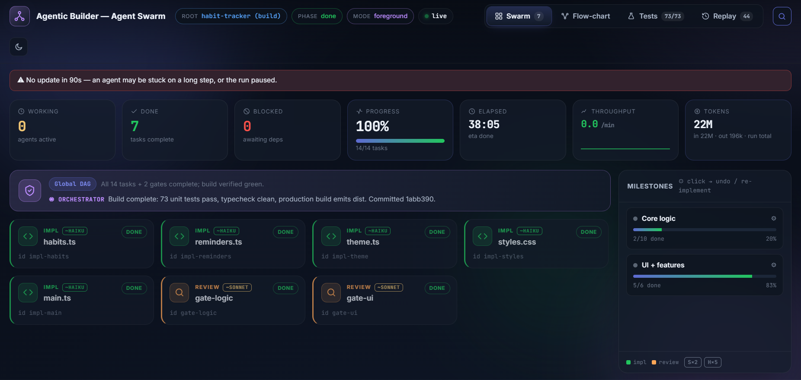

<div align="center">

# agentic·suite

**Build the software, then grow it — on a live dashboard.**

`SDLC + GROW` · in-session under Claude Code · **no API key**


</div>

> agentic-suite is a conductor that chains **BUILD → GROW** for a single request needing both software *and* the
> business work on top of it (SEO, marketing, sales, research, content). A parallel-agent swarm ships the product,
> hands off a factual brief, then grows it against what was actually built.




```
request ─▶ pre-flight ─▶ classify ─▶ split ─▶ [BUILD] ─▶ gate ─▶ HANDOFF.json ─▶ [GROW] ─▶ showcase
```

`parallel agent swarm` · `global DAG scheduler` · `TDD + two-stage review` · `live dashboards` · `192-persona registry` · `crash-resume`

---

## Install

```text
/plugin marketplace add FaisalNoman/agentic-suite
/plugin install agentic-suite@agentic-suite
```

One install registers all three bundled skills (conductor + agentic-app-builder + agentic-worker) and the shared
persona registry. **Requirements:** Claude Code + **Node.js 18+** (zero-dependency `.mjs` helpers). No API key.

## Quick start

Just prompt — nothing to set up first. On a fresh run the conductor auto-runs a pre-flight check, then drives the rest.

```text
Build a photo-manager web app, then write its SEO strategy,
a content-marketing plan, and a sales proposal.
```

| Intent | Routes to |
|---|---|
| **Build-only** — “build me X” | agentic-app-builder |
| **Grow-only** — “research X and write a report” | agentic-worker |
| **Mixed** — “build X then market it” | the full BUILD → GROW chain |
| **Unclear** | the conductor asks once (on the dashboard) |

---

## Workflow

```mermaid
flowchart LR
  R([request]) --> PF[pre-flight ✓] --> C[classify] --> S[split → briefs]
  S --> B
  subgraph B [BUILD · agentic-app-builder · :4317]
    direction LR
    I[interview] --> P[plan · DAG] --> T[TDD] --> M[impl ‖] --> RV[two-stage review] --> CM1[milestone gate · commit]
  end
  B --> G{gate · 2.5}
  G -->|fail| X[stop · resume BUILD]
  G -->|pass| H[HANDOFF.json]
  H --> GR
  subgraph GR [GROW · agentic-worker · :4318]
    direction LR
    D[domain · decompose] --> SP[specialists ‖] --> MG[coherence merge] --> SH[showcase.html]
  end
  GR --> DONE([summary])

  classDef k fill:#11161f,stroke:#7aa2ff,color:#e6edf3;
  classDef g fill:#0e131b,stroke:#2a3441,color:#aeb9c7;
  class B,GR k; class R,PF,C,S,H,DONE,X g;
```



Crash-resume at every level (`suite-state.json` · `framework-state.json`) · `/suite-resume` · live dashboards throughout.

---

## Routing — which engine runs

At Stage 0 the conductor classifies intent:

- Produces or edits **runnable code** → **BUILD** participates.
- Produces a **document / dataset / strategy** → **GROW** participates.
- **Both** → the chain. **Neither clear** → it asks once.

A marketing-flavoured noun doesn’t force GROW if the deliverable is software — *“an SEO **tool**”* is a BUILD;
*“landing-page **copy**”* is GROW.

| Prompt | Runs |
|---|---|
| “Build a todo web app” / “fix this bug” / “add dark mode” | builder only |
| “Build a landing page / website” | builder only (it’s code) |
| “Research & compare 5 CRM tools” / “write an SEO strategy” | worker only |
| “Write landing-page copy + 3 launch tweets” | worker only |
| “Build a photo manager, then write its SEO + GTM plan” | builder → worker |
| “Build a tool that generates SEO reports” | builder only (it’s a tool) |
| “Improve my site’s SEO” / “scrape competitor prices” | conductor asks (tool vs strategy/data) |

> [!NOTE]
> **Two things people miss.** Pre-build research is *not* GROW — “research the best stack then build it” is
> builder-only. And order is hard-wired **BUILD → GROW** (growth depends on the product existing).

---

## Engines

### BUILD — agentic-app-builder

Three modes auto-detected:

| Mode | When | Flow |
|---|---|---|
| **GREENFIELD** | from scratch | interview → design/wireframe → plan → TDD → parallel impl → review → finish |
| **FEATURE** | add to a codebase | repo survey → scope → impact + scoped plan → TDD → impl → stricter gate |
| **SURGICAL** | fix a bug | problem capture → systematic-debugging → targeted fix → verify |

- **Global dependency-graph scheduler** — every task whose deps are met runs in parallel; milestone gates live *inside* the DAG.
- **Design routing** → best installed design skill (ui-ux-pro-max first) generates a design system before UI code.
- **Wireframe/demo approval on the dashboard** — throwaway `demo/index.html`, Approve / Suggest before real code.
- **TDD** (tests-before-impl as DAG edges) + **two-stage review** (spec + quality) per milestone.
- **Per-language coding rules** injected per code agent (TS/JS/Py/Go/Rust/Java/C#).
- **Model tiering** — impl agents on the cheap tier, architect/review on the top tier.

### GROW — agentic-worker

- **192-persona specialist registry** (15 domains) with scored, scoped routing — only the needed persona loads per task.
- **Bring-your-own-docs gate** — reads `HANDOFF.json`, skips re-interviewing, grounds growth in the real product.
- **Showcase** — merges deliverables into `grow/outputs/` and auto-opens an interactive `showcase.html`.

### Handoff & the completion gate

- **Stage 2.5 gate** — `check-build-gate.mjs` must pass before GROW starts; trusts the script’s exit code, not prose.
- **HANDOFF.json** — product, features, stack, URLs, decisions, `build_status` — the cold-start brief GROW grows against.
- **Session boundary** — for a large build, resume GROW in a fresh session from `HANDOFF.json`.

---

## Live dashboard

Each phase opens a real-time, zero-dependency board (BUILD `:4317`, GROW `:4318`) over SSE. Two-way — questions and
approvals happen on the board, not the CLI.

| Tab | Shows |
|---|---|
| **Swarm** | live agent cards (status, model-tier badge, model-mix), 🟡 working / 🟢 done / 🔴 blocked |
| **Plan** | the DAG as an **animated flowchart**; plan-approval modal with 🗺 Open Plan |
| **Tests** | per-milestone unit results + live Playwright E2E stream |
| **Replay** | scrub the event log to reconstruct any past moment (auto-populated) |

Prompts & approvals (interview, plan, wireframe demo) pop as modals on the board; the demo opens itself.
**Tokens** show real spend split into *fresh · cache · out* (cache reads are ~10× cheaper).

**Persona routing** — preview the pick for any requirement without a run:

```bash
node ~/.claude/skills/agentic-suite/scripts/route-preview.mjs \
  "design an SEO strategy and keyword plan for a SaaS" --domains marketing,strategy
```

---

## Orchestration flow

### Operating principles

- **Mode-first** — detect GREENFIELD / FEATURE / SURGICAL before anything else.
- **Parallel fan-out is mandatory** — N ready tasks → N agents in one message.
- **Isolated writes** — each subagent owns one file; the scheduler defers overlapping `writes` (file-ownership locks).
- **Interfaces → tests → impl** — enforced as DAG edges, not serial phases.
- **Every step is a card** — no silent steps; everything appears on the board.
- **Crash-resume** — state persisted after every phase; re-run skips the done set.

### Conductor stages

```text
0 · pre-flight + classify → 1 · split → 2 · BUILD → 2.5 · gate → 3 · handoff → 4 · GROW → 5 · wrap
```

1. **Stage 0 — Pre-flight & classify.** Auto-run `suite-doctor`; classify into `{needs_build, needs_grow, build_brief, grow_brief}`.
2. **Stage 1 — Split.** Two scoped briefs; confirm once; persist to `suite-state.json`.
3. **Stage 2 — BUILD.** agentic-app-builder in `build/` (board :4317).
4. **Stage 2.5 — Gate (blocking).** `check-build-gate.mjs`; on fail → stop, report, offer resume.
5. **Stage 3 — Handoff.** Synthesize `HANDOFF.json` → `grow/plan/docs/`.
6. **Stage 4 — GROW.** agentic-worker in `grow/` (board :4318) against the real product.
7. **Stage 5 — Wrap.** Combined summary + showcase + Replay tabs.

<details>
<summary><b>BUILD flow — Stage 0 preflight + build loop</b></summary>

**Stage 0 (all modes):** resume check → mode detection → git init → dir setup → dashboard launch → worktree decision (G+F) → foreground/background + budget cap (G+F).

**Stages 1–3:** bring-your-own-docs gate (else interview A–D) → plan + global DAG + doc-quality gate (animated Plan tab, board approval) → wireframe loop (UI) → scaffold toolchain → one global scheduler run (architect → tdd → impl ‖ → milestone gate → two-stage review → commit) → **Phase 9 finishing** (verify, cleanup, BUILD-SUMMARY, commit, worktree merge, distil lessons).
</details>

<details>
<summary><b>GROW flow</b></summary>

```text
domain detect → docs gate (HANDOFF) → decompose → specialists ‖ → review gate → merge → showcase
```

Domain detection → docs gate (HANDOFF skips re-interview) → coordinator decomposes a task DAG → parallel specialists routed to scored personas (scoped, model-tiered) → review gate + coherence check → merge into `grow/outputs/` + auto-open `showcase.html`.
</details>

---

## Operate

### Pre-flight — suite-doctor

Auto-runs on a fresh run; proceeds only if the environment is sound. Manual:

```bash
/suite-doctor
# or
node ~/.claude/skills/agentic-suite/scripts/suite-doctor.mjs
```

Checks node, both skills, the registry, dashboard ports, write access, `suite-state.json` integrity, git, and
hook status. PASS / WARN / FAIL → exit 0 / 1 / 2.

### Enforcement hooks (opt-in)

Hook-free by default. For long/unattended runs, install a pack that turns prose rules into deterministic guards the
whole swarm (incl. subagents) can’t skip — **dormant unless a run is active**, **fail-open**.

```bash
node ~/.claude/skills/agentic-suite/scripts/install-hooks.mjs   # --scope user for global
# then restart Claude Code (hooks load at session start)
```

| Hook | Event | Guards |
|---|---|---|
| config-protection | PreToolUse | no weakening test/lint/tsconfig configs mid-run |
| protect-state | PreToolUse | no editing `.git` / settings / hook & dashboard infra |
| dangerous-bash | PreToolUse | no `rm -rf /`, `git push --force`, `reset --hard`, `curl\|sh` |
| circuit-breaker | PostToolUse | trips after 5 consecutive failures |
| cost-persist | PostToolUse | persists token spend + budget alert |
| state-verify | SessionStart | resume nudge if a run is mid-flight |
| precompact-snapshot | PreCompact | snapshots state before compaction |

Escape hatches: `plan/state/.allow-config-edit`, `plan/state/.allow-danger`. Remove with `uninstall-hooks.mjs`.

### Cross-run learning

Each run distils atomic **lessons** (from signals + user overrides) into `.agentic-builder/lessons.json`, deduped and
confidence-weighted; the next run warm-starts from the relevant ones.

### State & resume

`suite-state.json` (conductor) and `framework-state.json` (each engine) are the source of truth. On a re-run or fresh
session, state is read and the run resumes where it stopped.

```bash
/suite-resume   # briefing: phase, outstanding milestones, next action
```

> [!WARNING]
> Skill & dashboard-template changes apply to the **next fresh run after a Claude Code restart** — a running session
> keeps the old skill in memory, and an in-progress project keeps the template it copied at start.

### Commands & scripts

| Command / script | What it does |
|---|---|
| `/suite-doctor` | Pre-flight environment check (auto-runs at Stage 0; also manual). |
| `/suite-resume` | Briefing of an interrupted run + where to continue. |
| `scripts/check-build-gate.mjs` | Deterministic BUILD-completion gate (Stage 2.5). |
| `scripts/install-hooks.mjs` / `uninstall-hooks.mjs` | Install / remove the opt-in enforcement pack. |
| `scripts/scan-surface.mjs` | Advisory injection scan of personas + skill/settings/hook files. |
| `scripts/route-preview.mjs` | Preview which persona the router picks for a requirement. |

All scripts are zero-dependency Node (`.mjs`) — cross-platform, no install step.

---

## Architecture

The conductor is deliberately **thin**: classify, sequence, gate, bridge — it owns no build or growth logic. One shared
`agents/` folder holds the registry both engines resolve via `../agents/registry.json`.

```text
agentic-suite/skills/
  agents/                shared registry (192 personas, 15 domains) + persona .md
  conductor/             the BUILD→GROW orchestrator  ("agentic-suite")
    scripts/  hooks/  commands/   doctor · gate · hooks · scan · resume · route-preview
  agentic-app-builder/   software engine  → resolves ../agents
  agentic-worker/        growth engine    → resolves ../agents
```

## Roadmap

- **Now:** bundled engines + HANDOFF bridge + deterministic gate; dashboard prompts / approval / animated flow /
  model badges / real-token KPI; opt-in enforcement hooks; security scan; per-language rules; model tiering; lessons
  ledger; pre-flight doctor; showcase.
- **Planned:** unified BUILD → GROW dashboard (one board, one timeline); a shared core (scheduler / registry / memory /
  dashboard) so both engines become thin frontends.

<div align="center">

*In-session · no API key · MIT* — [full styled docs](index.html) · [GitHub](https://github.com/FaisalNoman/agentic-suite)

</div>
